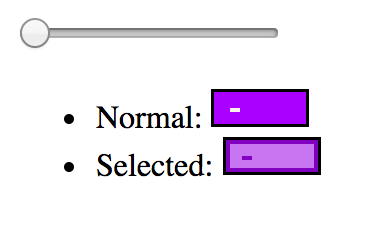
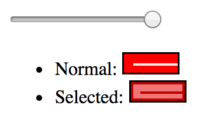

# svg-midi-note

Render a Midi Note as SVG with velocity and a selected state.





## Usage

```js
const Note = require('svg-midi-note')

const note = Note()

const el = note.render({
  height: 20,
  width: 50,
  velocity: 0.8,
  selected: true
})

svg.appendChild(el)
```

## License

MIT
